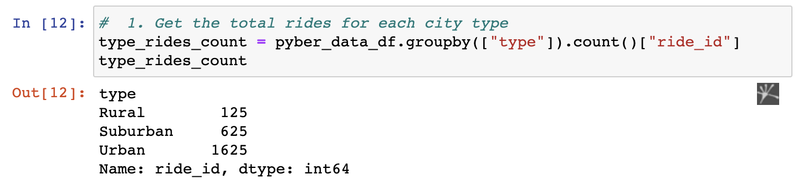

# PyBer_Analysis
The PyBer analysis makes the posibility to apply several Pandas libraries, focusing specially in the Matpltlib library that helps to create visualizations with robust features. For more information: [Matplotlib](https://matplotlib.org/3.1.0/index.html).

## Overview of the analysis
The analysis suggests to create several `charts` that show visualy the direction of the business by using matplotlib. During the analysis, it is necessary to performe scatter plot, linear, bars, horizontal bars, chart with errors, and pie charts.:monkey:

The data is analyzed by two different methods:
1. MATLAB Approach
2. Object-Oriented Approach

The goal is to escalate the dataset in a chart presentation where different parameters such as types of cities, number of rides, fares, number of drivers, and dates.

## Results
### Delivery 1

1. The total number of rides for each city type is retrieved.

2. The total number of drivers for each city type is retrieved.
!(https://github.com/ale-river/PyBer_Analysis/blob/main/Other_resources/2.png)

3. The sum of the fares for each city type is retrieved.
!(https://github.com/ale-river/PyBer_Analysis/blob/main/Other_resources/3.png)

4. The average fare per ride for each city type is calculated.
!(https://github.com/ale-river/PyBer_Analysis/blob/main/Other_resources/4.png)

5. The average fare per driver for each city type is calculated.
!(https://github.com/ale-river/PyBer_Analysis/blob/main/Other_resources/5.png)

6. A PyBer summary DataFrame is created.
!(https://github.com/ale-river/PyBer_Analysis/blob/main/Other_resources/6.png)

and 

!(https://github.com/ale-river/PyBer_Analysis/blob/main/Other_resources/7.png)

7. The PyBer summary DataFrame is formatted as shown in the example.
!(https://github.com/ale-river/PyBer_Analysis/blob/main/Other_resources/8.png):hugs: :partying_face:

### Delivery 2
A datafframe was created to `groupby()` function, the type of city and the dates.

1. A DataFrame was created using the groupby() function on the "type" and "date" columns, and the sum() method is applied on the "fare" column to show the total fare amount for each date and time.
!(https://github.com/ale-river/PyBer_Analysis/blob/main/Other_resources/1.2.png)

2. A DataFrame was created using the pivot() function where the index is the "date," the columns are the city "type," and the values are the "fare."
!(https://github.com/ale-river/PyBer_Analysis/blob/main/Other_resources/2.2.png)

3. A DataFrame was created using the loc method on the date range: 2019-01-01 through 2019-04-29.
!(https://github.com/ale-river/PyBer_Analysis/blob/main/Other_resources/3.2.png)

4. A DataFrame was created using the resample() function in weekly bins and shows the sum of the fares for each week.
!(https://github.com/ale-river/PyBer_Analysis/blob/main/Other_resources/4.2.png)

5. An annotated chart showing the total fares by city type is created and saved to the "analysis" folder. :brain: :globe_with_meridians:
!(https://github.com/ale-river/PyBer_Analysis/blob/main/Other_resources/5.2.png)

## Summary
